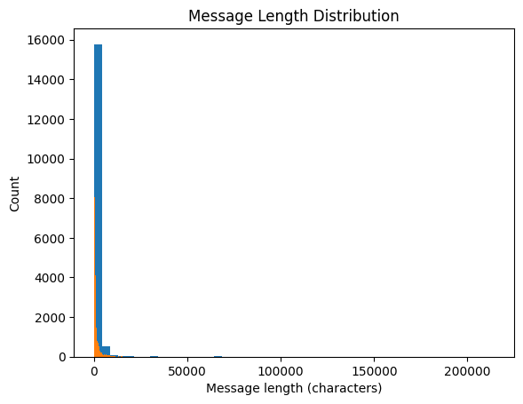

# Exploratory data analysis 1

**INPUT**: Raw corpus

**OUTPUT**: Preprocessing decisions + Stratified split

| Step | Decision | Status | Comment |
|------|----------|--------|---------|
| Stratified split | In setup part | Done |  |
| Columns & Shape | Drop some | Decided | Date not valuable for this project, drop in preprocessing |
| Columns Subject & Message | Merge | Decided | Own decision, merge in preprocessing |
| Empty values | Remove | Decided | Insignificant amount, remove in preprocessing |
| Duplicates | Remove | Decided | Insignificant amount, remove in preprocessing |
| Label balance | No action | Done | Near 50-50 |
| Message length distribution | Remove outliers | Decided | Use the 1.5xIQR (John Tukey) rule, lower is minus, add one manually |
| Patterns | Replace | Decided | Replace them in preprocessing if they can be renormalized (they are exploded with spaces) |
| Repeated chars | Collapse them | Decided | Same char appearing > 3 times. Collapse them to unified 2 chars |
| Special chars | Keep some | Pending | Maybe ! ? % $ are meaningful keep them? Ask Consultant |
| Vocabulary size estimation | Between 16-32k | Decided | For LSTM start with low |

## Columns and shape

    Number of entires: 33716,
    Number of columns: 4
    Column names: Subject, Message, Spam/Ham, Date
    

## Detect empty values

    Number of empty values:
    Message           371
    Subject           289
    Spam/Ham            0
    Date                0
    

## Detect duplicates

    Duplicates found: 2953
    

## Label balance inspection

    Class distribution for Spam/Ham in corpus:
    Number of labels:
    Spam: 17171
    Ham: 16545
    Percentage of labels:
    Spam: 50.93 %
    Ham: 49.07 %
    
    
    

## Patterns to replace

    Number of urls:             266754
    Number of emails:            16294
    Number of phones:            11992
    Number of nums:             435439
    Number of uppercases:            0
    Number of repeated_chars:    79316
    

## Message length distribution

    count:     33716.00
    mean:       1365.63
    std:        4026.07
    min:           1.00
    25%:         286.00
    50%:         613.00
    75%:        1387.25
    max:       214422.00
    

    

    

    IQR rule outlier limits
    Upper limit: 3039
    Lower limit: -1365
    

### Vocabulary size estimation

    Estimated vocabulary size: 120735
    
