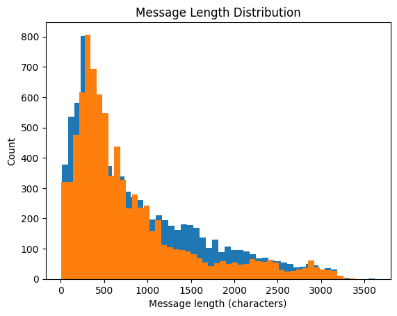

# Verification

**INPUT**: Preprocessed train, validation, test corpora

**OUTPUT**: Preprocessing validation, tokenizer parameter decisions

| Step | Decision | Status | Comment |
|------|----------|--------|---------|
| Preprocessing impact | Evaluate cleaning | Done | Message length distribution (only on train), removed messages |
| Class distribution | Detect imbalance | Done | Compare train/val/test |
| Vocabulary size estimation | Model complexity | Done | Unique tokens in train, rare tokens? |

## Message length distribution

    count:     17387.00
    mean:        844.98
    std:         726.25
    min:           8.00
    25%:         307.00
    50%:         592.00
    75%:        1165.00
    max:        3618.00
    

    

    

## Removed messages

    Original number of entries: 33716
    New number of entries: 29405
    Number of removed entries: 4311
    

## Check Class distribution

    Class distribution for Spam/Ham in train corpus:
    Number of labels:
    Ham: 8842
    Spam: 8545
    Percentage of labels:
    Ham: 50.85 %
    Spam: 49.15 %
    
    
    Class distribution for Spam/Ham in validation corpus:
    Number of labels:
    Spam: 3007
    Ham: 2968
    Percentage of labels:
    Spam: 50.33 %
    Ham: 49.67 %
    
    
    Class distribution for Spam/Ham in test corpus:
    Number of labels:
    Spam: 3028
    Ham: 3015
    Percentage of labels:
    Spam: 50.11 %
    Ham: 49.89 %
    
    
    

## Vocabulary size estimation

    Estimated vocabulary size: 82789
    Number of rare tokens (frequency < 3): 51717
    Percentage of rare tokens: 62.47%
    31072 tokens occur at least 3 times
    
