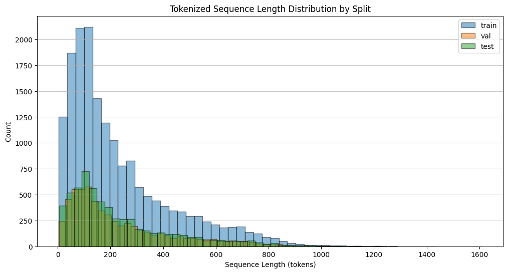
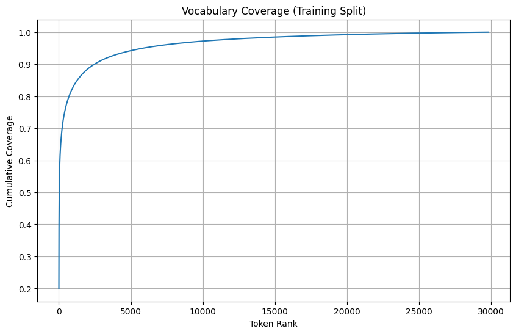

# Validation

**INPUT**: Tokenized train, validation, test corpora

**OUTPUT**: Model parameter recommendations

| Step | Decision | Status | Comment |
|------|----------|--------|---------|
| Tokenized sequence length distribution | - | Pending | - |
| Vocabulary coverage analysis | - | Pending | - |

## Tokenized Sequence Length Distribution

    

    

    train — mean: 231.73, median: 162.0, min: 4, max: 1610
    val — mean: 236.98, median: 166.0, min: 3, max: 1252
    test — mean: 234.37, median: 165.0, min: 6, max: 1436
    

## Vocabulary Coverage

    

    

    Top 30 tokens in training set:
           token   count  cum_freq
    0          ▁  803357  0.199389
    52     <NUM>  129549  0.231542
    62         ,  101526  0.256741
    2          :   81991  0.277090
    16         s   78560  0.296589
    40     <URL>   76343  0.315536
    143     ▁the   71863  0.333372
    25       ▁to   64843  0.349466
    49         -   57554  0.363751
    19         .   56858  0.377863
    79         /   51109  0.390548
    119     ▁and   42114  0.401000
    209      ▁of   34954  0.409675
    138       ▁a   34157  0.418153
    35      ▁you   32594  0.426243
    117     ▁for   28905  0.433417
    146      ▁in   26187  0.439916
    8        ing   23331  0.445707
    183       ed   23175  0.451459
    1    subject   23094  0.457191
    137      ▁is   21884  0.462622
    181    ▁your   20378  0.467680
    152        d   19660  0.472559
    259       ▁i   19082  0.477295
    107      ▁on   18590  0.481909
    375        '   17634  0.486286
    103    ▁this   17562  0.490645
    34         !   17146  0.494900
    315      ▁be   15592  0.498770
    18         y   14792  0.502441
    
